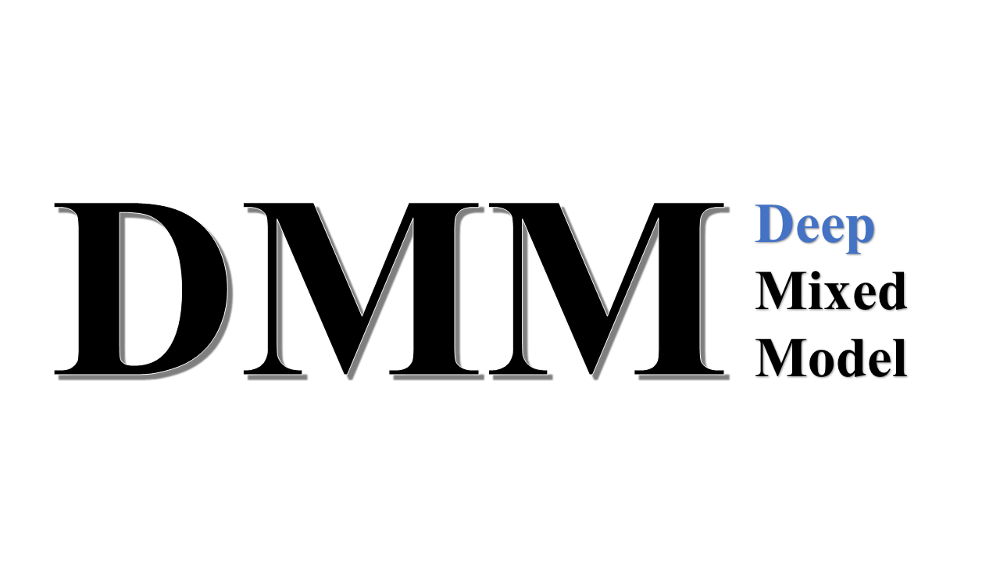

# DMM (Deep Mixed Model)

Implementation of DMM in this paper:

Wang H., Yue T., Yang J., Wu W., and Xing EP, Deep Mixed Model for Marginal Epistasis Detection and Population Stratification Correction in Genome-Wide Association Studies (_under review_) 

## Introduction

DMM (Deep Mixed Model) aims to extend the power of linear mixed model in correcting population stratification and identifying the associated genetic markers with the universarial approximation power of deep neural networks to model epistasis. 

<!---  -->

**Replication:** This repository serves for the purpose to guide others to use our tool, if you are interested in the scripts to replicate our results, please contact us and we will share the repository for replication. Contact information is at the bottom of this page.

## File Structure:

* [model/](https://github.com/HaohanWang/DMM/tree/master/model) main method for DMM
* [libs/](https://github.com/HaohanWang/DMM/tree/master/libs) other helper files, and definitions of the two components. 

## Usage:

#### Instructions

*  Use loadData() in libs/helpingFun.py to load data. Users need to specify which data to load here. 
*  Run model.py in model/ to run the program. 
*  Parameter settings are in the model.py
      - 

parameters

        

              
          - epochs for both CNN and LSTM
          - learning rates for both CNN and LSTM
          - batch size
          - hidden state size (we use a percentage to control the hidden state size)
          - dropout rate
        

#### Data Support
* DMM supports .npy file, as shown in loadData() in libs/helpingFun.py
    - X.npy is a n x p matrix, with n samples and p SNPs
    - Y.npy is a n x 1 matrix, with n samples and 1 phenotype

## Contact
The idea of the paper is from [Haohan Wang](http://www.cs.cmu.edu/~haohanw/)
&middot;
[@HaohanWang](https://twitter.com/HaohanWang)

The code is mostly written by [Tianwei Yue](https://github.com/ThitherShore)
